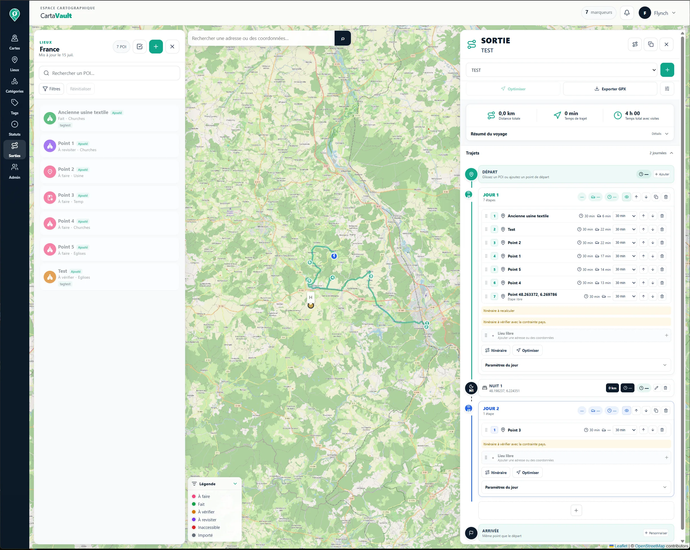
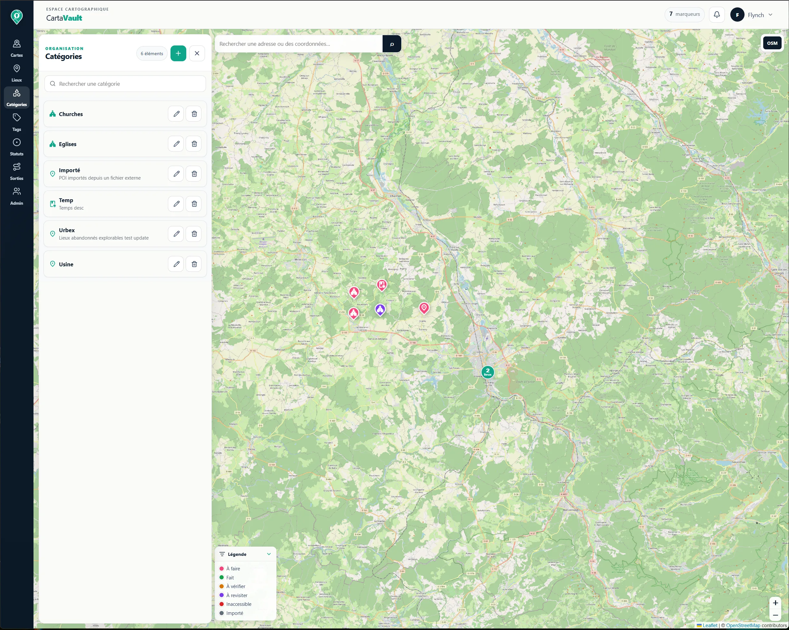
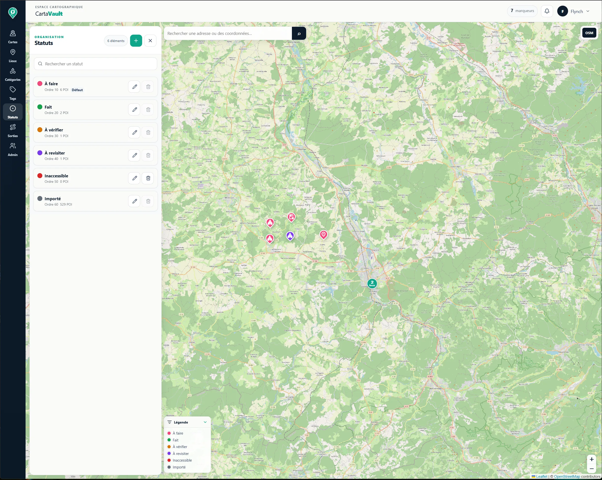
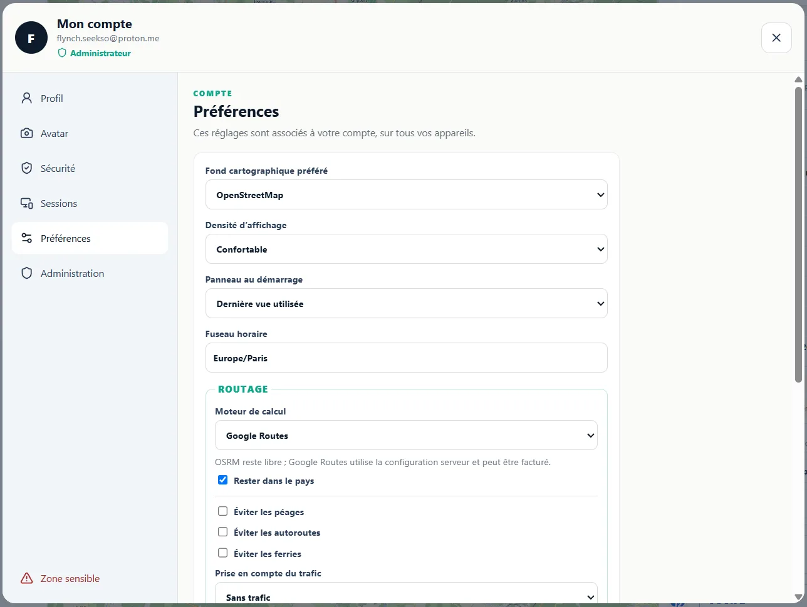

# CartaVault

<p align="center">
  
  
  
  
  
</p>

CartaVault est une application cartographique **open source et auto-hébergeable** permettant de centraliser des points d’intérêt, organiser des cartes privées, préparer des sorties et conserver la maîtrise de ses données.

Le projet associe une API **FastAPI**, une base **PostgreSQL/PostGIS** et une interface **React TypeScript** construite autour d’une carte Leaflet permanente.

> **État du projet :** développement actif. Certaines procédures de déploiement et de migration peuvent encore évoluer avant la première version stable.

## Aperçu

<p align="center">
  
</p>

<p align="center">
  
</p>

<table>
  <tr>
    <td width="50%">
      
    </td>
    <td width="50%">
      
    </td>
  </tr>
  <tr>
    <td align="center"><strong>Catégories et pictogrammes</strong></td>
    <td align="center"><strong>Statuts de suivi</strong></td>
  </tr>
</table>

<p align="center">
  
</p>

## Fonctionnalités principales

### Cartes et lieux

- création et gestion de cartes privées associées à un pays ;
- affichage cartographique des POI avec chargement limité à l’emprise visible ;
- clustering local des marqueurs standards ;
- création d’un lieu depuis la carte, la recherche géographique ou des coordonnées GPS ;
- fiche enrichie avec description, coordonnées, catégories, tags, statut, photos et liens ;
- champs facultatifs configurables par carte ;
- favoris, notes avant et après visite, tri et filtres avancés ;
- corbeille, restauration et historique d’audit ;
- lien direct vers Google Maps lorsque les coordonnées sont disponibles.

### Catégories, icônes, tags et statuts

- gestion complète des catégories, tags et statuts ;
- catalogue local fermé de **300 icônes de catégories**, partagé entre le frontend et le backend ;
- aucune URL, aucun SVG arbitraire et aucun appel réseau pour les pictogrammes ;
- catégorie principale utilisée pour le pictogramme du marqueur ;
- statut utilisé pour sa couleur ;
- légende compacte des statuts actifs ;
- distinction entre le statut de suivi et l’état physique du lieu.

### Photos

- ajout multiple de photos JPEG, PNG et WebP ;
- sélection de la photo principale ;
- réorganisation et suppression ;
- stockage local sécurisé distinct des avatars utilisateurs.

### Import et export

- import KML/KMZ en deux étapes avec prévisualisation et confirmation ;
- prise en charge des `Placemark` de type `Point`, des `ExtendedData` et des images embarquées ;
- contrôle des archives, chemins, tailles, liens et doublons ;
- conservation des champs non mappés dans les champs personnalisés ;
- export des sorties vers Google Maps, GPX et KMZ.

### Préparation de sorties

- sorties composées de plusieurs journées ;
- étapes liées à un POI ou ajoutées librement ;
- ajout et réorganisation par glisser-déposer ;
- hébergement entre deux journées ;
- calcul séparé de la distance, du temps de conduite, des visites, des tampons et de la marge de sécurité ;
- départ recommandé ou arrivée estimée ;
- seuils personnalisables de charge journalière ;
- optimisation d’ordre facultative, toujours soumise à validation ;
- couleur de tracé par journée ;
- signalement des itinéraires obsolètes ou partiels.

### Routage

CartaVault utilise **OSRM** par défaut et peut utiliser **Google Routes API** comme moteur alternatif.

- choix du moteur dans les préférences du compte ;
- clé Google propre à chaque utilisateur ;
- chiffrement côté serveur avec une clé maîtresse Fernet ;
- clé utilisateur jamais renvoyée au navigateur ;
- quotas et erreurs isolés par utilisateur ;
- retour automatique à OSRM après suppression des identifiants Google ;
- option « Rester dans le pays » avec contrôle de la géométrie calculée.

### Multi-utilisateur et permissions

- authentification avec sessions serveur ;
- cartes privées ;
- un propriétaire par carte ;
- membres avec rôles `viewer` ou `editor` ;
- administrateurs globaux ;
- droits appliqués aux cartes, lieux et sorties ;
- espace Compte pour le profil, l’avatar, la sécurité, les sessions, les préférences et la suppression ou l’anonymisation du compte.

Il n’existe actuellement ni inscription publique, ni carte publique, ni envoi automatique d’e-mail pour les invitations.

### Fonds cartographiques

Le fond peut être changé sans recharger la carte :

- CartaVault Light ;
- CartaVault Dark ;
- Satellite ;
- OpenStreetMap Standard.

Les fonds CartaVault utilisent Stadia Maps. Hors environnement local, configurez une clé restreinte avec `VITE_STADIA_MAPS_API_KEY` ou une authentification par domaine.

## Architecture

```text
CartaVault/
├── backend/
│   ├── app/                 # API FastAPI organisée par fonctionnalité
│   ├── migrations/          # migrations Alembic
│   ├── storage/             # stockage local des fichiers
│   └── tests/               # tests backend
├── database/
│   └── init/                # initialisation PostgreSQL/PostGIS
├── docs/
│   └── screenshots/         # captures d’écran du projet
├── frontend/                # Vite, React, TypeScript et Leaflet
├── shared/                  # ressources partagées frontend/backend
├── docker-compose.yml
├── LICENSE
└── README.md
```

La documentation technique détaillée du backend se trouve dans [`backend/README.md`](backend/README.md).

## Stack technique

- **Frontend :** React, TypeScript, Vite, Leaflet ;
- **Backend :** FastAPI, SQLAlchemy, GeoAlchemy2 ;
- **Base de données :** PostgreSQL et PostGIS ;
- **Migrations :** Alembic ;
- **Tests :** pytest et tests frontend automatisés ;
- **Déploiement local :** Docker Compose.

## Démarrage rapide sous Windows

### Prérequis

- Git ;
- Docker Desktop avec Docker Compose ;
- Python 3.14 ;
- Node.js et npm.

### Base de données et backend

Depuis la racine du dépôt, créez d’abord la configuration Docker Compose :

```powershell
Copy-Item .env.example .env
docker compose up -d postgres
Set-Location backend
python -m venv .venv
.\.venv\Scripts\Activate.ps1
python -m pip install -r requirements.txt
Copy-Item .env.example .env
```

Renseignez ensuite les variables nécessaires dans `backend/.env`, notamment `DATABASE_URL`. Ne versionnez jamais ce fichier.

Appliquez les migrations puis démarrez l’API :

```powershell
python -m alembic upgrade head
python -m uvicorn app.main:app --reload
```

Swagger est disponible sur <http://127.0.0.1:8000/docs>.

> La baseline Alembic initiale représente un schéma préexistant. Pour une base entièrement vide, utilisez la procédure Docker fournie avec le projet.

### Frontend

Dans un second terminal :

```powershell
Set-Location frontend
npm install
Copy-Item .env.example .env
npm run dev
```

Vite affiche l’adresse locale, généralement <http://localhost:5173>.

## Configuration de Google Routes

Chaque utilisateur peut enregistrer sa propre clé Google Routes depuis son espace Compte. L’instance doit également définir une clé maîtresse de chiffrement :

```text
CARTAVAULT_CREDENTIALS_ENCRYPTION_KEY=<clé-fernet>
```

Pour en générer une :

```powershell
python -c "from cryptography.fernet import Fernet; print(Fernet.generate_key().decode())"
```

Cette valeur doit être conservée dans un secret de déploiement ou un fichier `.env` non versionné. Sa perte rend les clés Google déjà enregistrées indéchiffrables.

La clé Google doit être restreinte à Routes API et, lorsque cela est possible, aux adresses IP du serveur. Activez également des quotas et des alertes budgétaires dans Google Cloud.

## Sécurité

Avant de publier ou déployer le projet :

- ne versionnez aucun fichier `.env` ;
- ne stockez aucune clé API, aucun mot de passe ni secret Docker dans Git ;
- sauvegardez la base avant toute migration ;
- utilisez des clés de chiffrement et secrets distincts par environnement ;
- configurez des restrictions sur les clés Stadia Maps et Google Routes ;
- vérifiez également l’historique Git avant de rendre un dépôt public.

## État du projet

CartaVault est actuellement utilisable en développement local et couvre déjà :

- les cartes et lieux ;
- les catégories, tags, statuts et 300 icônes locales ;
- les photos ;
- l’import KML/KMZ ;
- les utilisateurs, rôles et permissions ;
- la préparation et l’optimisation des sorties ;
- le routage OSRM et Google Routes ;
- les filtres avancés et actions groupées ;
- la corbeille et l’historique des lieux ;
- l’espace Compte et les préférences utilisateur.

Les principaux travaux restant avant une version stable concernent notamment :

- la finalisation du déploiement de production ;
- l’amélioration continue de l’interface et de l’accessibilité ;
- le renforcement de la documentation d’installation et de migration ;
- le stockage objet optionnel pour les déploiements distribués ;
- la préparation d’un parcours d’inscription et d’invitation adapté à une éventuelle offre SaaS.

## Contribution

Les contributions, rapports de bugs et propositions d’amélioration sont les bienvenus via les issues et pull requests GitHub.

Avant toute contribution importante, ouvrez de préférence une issue afin de discuter du besoin et de son intégration dans l’architecture du projet.

## Licence

CartaVault est distribué sous licence MIT. Consultez le fichier [`LICENSE`](LICENSE) pour plus d’informations.