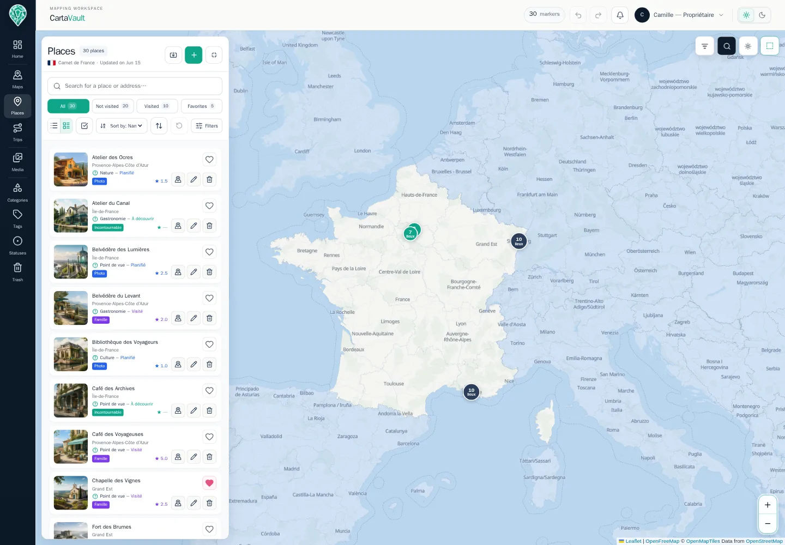
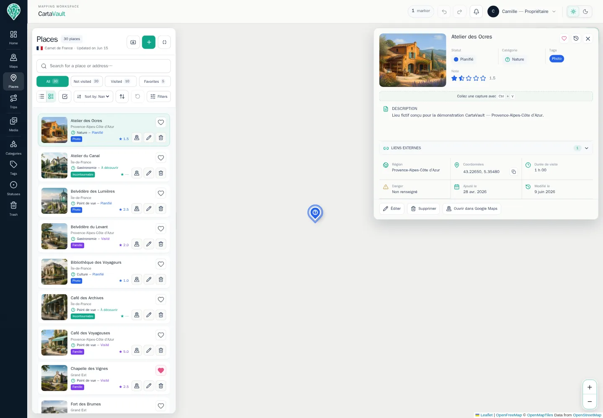
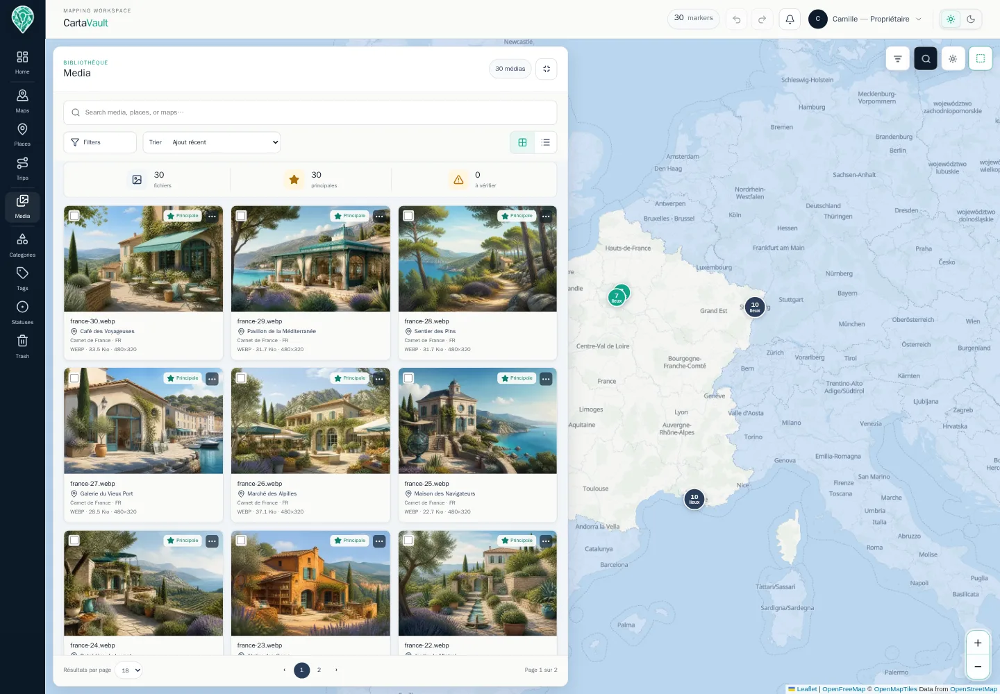
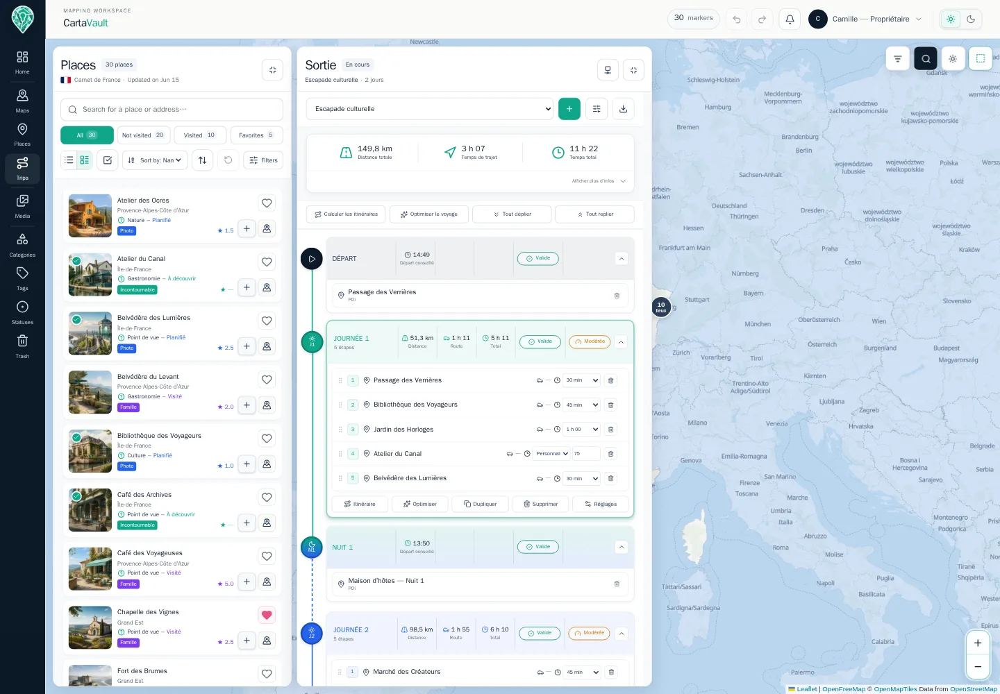
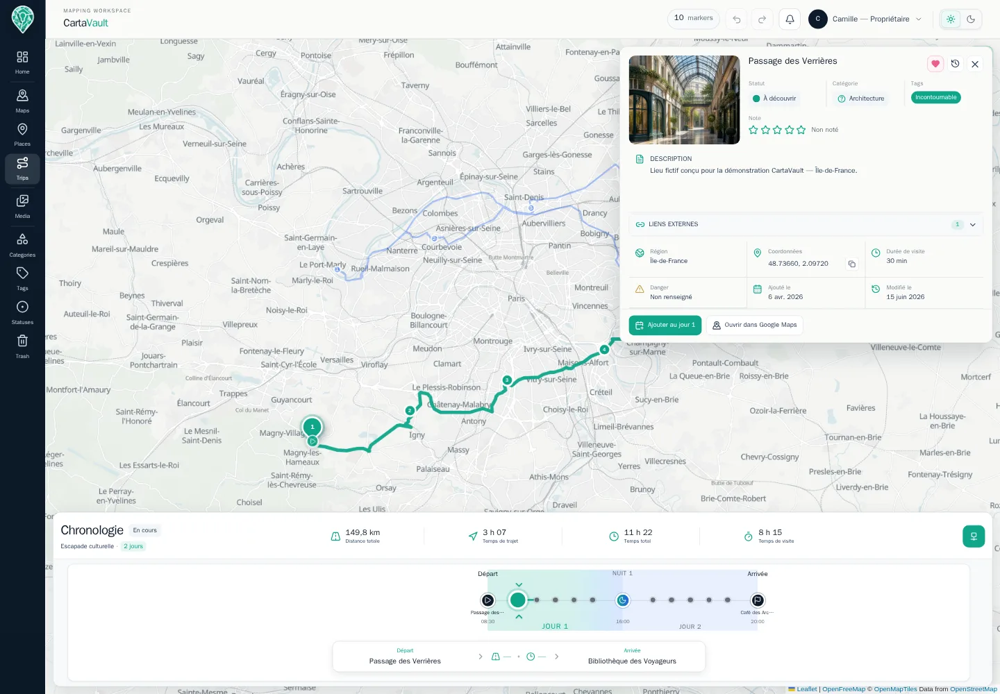
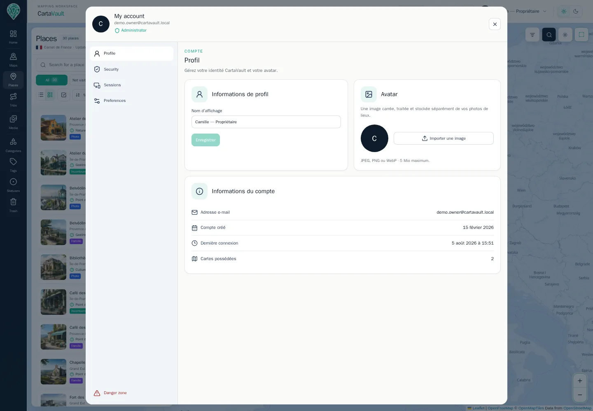
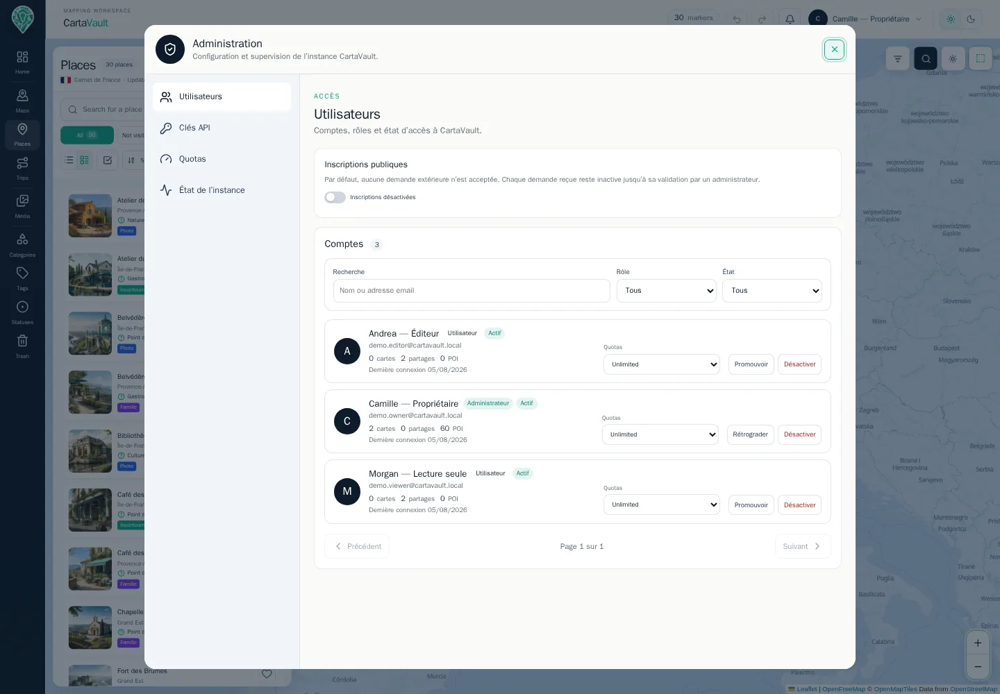

# CartaVault

<p align="center">
  <a href="https://github.com/FlynX9/CartaVault/actions/workflows/ci.yml"></a>
  
  
  
  
  
</p>

> **Your private library of places — organized, mapped and ready for the road.**

CartaVault is an open-source, self-hosted workspace for collecting places on private maps, enriching them with useful context, and planning multi-day trips around them.

It combines rich POI records, route-aware trip planning and portable exports in a FastAPI, PostgreSQL/PostGIS and React application—so your maps, media and provider credentials remain under your control.

[Website](https://cartavault.fr) · [Documentation](https://cartavault.fr/docs/en/) · [Docker guide](docker/README.md) · [Issues](https://github.com/FlynX9/CartaVault/issues)

<p align="center">
  
</p>

> [!IMPORTANT]
> CartaVault is currently in public beta. APIs, migrations and deployment contracts may still evolve. Back up your database and media before every upgrade.

## Why CartaVault?

- **Private by default** — country-based maps with owner, editor and viewer roles.
- **Self-hosted** — run the application and its data on infrastructure you control.
- **Rich place records** — photos, ratings, visit duration, categories, tags and named links in one place.
- **Trip-first planning** — arrange days, nights, stops and schedules on top of the map.
- **Route-aware decisions** — calculate, review and optimize daily routes before applying changes.
- **Portable data** — import and export KML/KMZ, and generate configurable trip PDFs.

## Product tour

### Collect places

Keep each address, landmark or discovery as a complete, illustrated record. Filter large collections, search by address or coordinates, and keep the map visible while you work.

<p align="center">
  
</p>

<table>
  <tr>
    <td width="50%"></td>
    <td width="50%"></td>
  </tr>
  <tr>
    <td align="center"><strong>Detailed, illustrated place records</strong></td>
    <td align="center"><strong>A permission-aware media library</strong></td>
  </tr>
</table>

### Plan trips

Turn reusable places into an outing with a departure, daily stops, accommodation and arrival. Review the distance, driving time, visit time and route proposal before committing an optimization.

<p align="center">
  
</p>

### Follow the journey

The interactive timeline keeps the active step, route and map synchronized, making the whole trip easy to review without losing context.

<p align="center">
  
</p>

### Manage your data

Profile preferences, credentials, sharing and administration stay inside CartaVault, with access controls that remain understandable for both users and instance operators.

<table>
  <tr>
    <td width="50%"></td>
    <td width="50%"></td>
  </tr>
  <tr>
    <td align="center"><strong>Profile, preferences and API keys</strong></td>
    <td align="center"><strong>Administration and access control</strong></td>
  </tr>
</table>

The screenshots use deterministic synthetic demo data and original generated artwork. They do not reproduce third-party photographs or private user data.

## Highlights

### Maps & places

- private country-based maps with owner, editor and viewer roles;
- rich POI records: media, ratings, duration, categories, tags and named links;
- viewport-based loading, clustering, virtualization, filters and bulk actions;
- address/GPS creation plus KML/KMZ import and export;
- trash, restoration, retention and detailed audit history.

### Trips & exports

- reusable POIs across multi-day outings, with days, nights, departure and arrival;
- routing, workload and schedule calculations with an explicit optimization review;
- interactive map and timeline synchronized with the selected route segment;
- configurable PDF export with maps, photos and Google Maps or Waze QR codes.

### Data, accounts & presentation

- multiple JPEG, PNG and WebP images, paste support and keyboard-accessible galleries;
- server-side sessions, CSRF protection, password reset and configurable registration safeguards;
- invitations, ownership transfer, French and English interfaces and transactional emails;
- responsive light/dark interface and installable PWA shell with safe update prompts.

## Architecture

```text
Browser
  └── CartaVault application
      ├── compiled React interface
      ├── FastAPI API and OpenAPI
      ├── Alembic migrations
      └── local persistent media storage
          └── PostgreSQL + PostGIS
```

The supported public-beta topology contains exactly two standard services:

| Service | Responsibility |
|---|---|
| `cartavault` | API, compiled frontend, migrations and background maintenance |
| `postgis` | relational and geographic data |

Redis and the RQ worker are an optional extension for independently processed long tasks. They are not required for a standard mono-instance deployment.

### Deployment at a glance

- two standard containers: CartaVault and PostgreSQL/PostGIS;
- persistent local database, photos and avatars;
- HTTPS recommended for every untrusted network;
- optional Redis/RQ worker for long-running background work.

### Repository layout

```text
CartaVault/
├── backend/             # FastAPI, SQLAlchemy, Alembic and pytest
├── demo/                # deterministic demo seed and screenshot automation
├── docker/              # standard, Portainer and optional Redis deployments
├── docs/                # operational and security documentation
├── frontend/            # React, TypeScript, Vite and Leaflet
├── shared/              # shared icon and metadata resources
├── website/             # Astro marketing website
└── README.md
```

## Quick start

### Docker

Docker is the recommended way to run a public-beta instance. The published application image is available from GitHub Container Registry:

```text
ghcr.io/flynx9/cartavault:1.0.0-rc.3
```

For a source build, create a versioned application image and pull the pinned PostGIS companion:

```powershell
.\docker\build.ps1 -Version "1.0.0-rc.3"
```

1. Copy and review the environment file.
2. Generate persistent secrets.
3. Start the two-service stack.

```powershell
Copy-Item docker\.env.example docker\.env
docker compose --env-file docker/.env -f docker/compose.setup.yml run --rm setup generate-secrets
docker compose --env-file docker/.env -f docker/compose.yml up -d
docker compose --env-file docker/.env -f docker/compose.yml ps
```

The application waits for PostGIS, applies every Alembic migration and only becomes healthy after startup has completed. Open the configured public URL to finish the protected setup wizard.

For NAS installation, offline image export, Portainer, reverse proxies, upgrades, rollback and the optional Redis worker, use the [Docker deployment guide](docker/README.md).

### Local development on Windows

Requirements: Git, Docker Desktop, Python 3.14, Node.js and npm.

Start PostgreSQL/PostGIS from the repository root:

```powershell
Copy-Item .env.example .env
docker compose up -d postgres
```

Start the backend:

```powershell
Set-Location backend
python -m venv .venv
.\.venv\Scripts\Activate.ps1
python -m pip install -r requirements-dev.txt
Copy-Item .env.example .env
python -m alembic upgrade heads
python -m app.cli create-admin
python -m uvicorn app.main:app --reload
```

Start the frontend in a second terminal:

```powershell
Set-Location frontend
npm ci
Copy-Item .env.example .env
npm run dev
```

The frontend is usually available at <http://localhost:5173>. From another device on the same private Wi-Fi, use the computer's IPv4 address, for example <http://192.168.1.50:5173>. Vite is configured to listen on the private network; Windows may ask for permission the first time. The local API documentation is available at <http://127.0.0.1:8000/docs>; the unified Docker image exposes it below `/api/docs`.

Detailed development notes live in the [backend](backend/README.md) and [frontend](frontend/README.md) guides.

## Configuration notes

### Routing, place search and map backgrounds

Account **API keys** centralizes the routing engine, place-search engine and basemap credentials. Provider credentials are encrypted server-side; their status exposes only the last four characters.

| Capability | Default | Optional personal provider |
|---|---|---|
| Routing | OSRM | Google Routes |
| Place search | Stadia public access | Google Places or a personal Stadia key |
| Satellite map | Disabled | Stadia, Mapbox, or Google Maps JavaScript API |

There is no global Stadia key or build argument. A verified personal Stadia key uses the associated Stadia plan; without one, CartaVault uses public access. Google Satellite offers two implementations: Maps JavaScript API for EEA-compatible rendering with a dedicated referrer-restricted browser key, and Map Tiles API for Google projects where satellite tiles remain available with a server key. Google Routes and Google Places remain separate uses. See the [Google Satellite integration and cost model](docs/google-satellite.md).

When personal provider credentials are stored, preserve this encryption key with the database backup:

```text
CARTAVAULT_CREDENTIALS_ENCRYPTION_KEY=<fernet-key>
```

Generate a Fernet key with:

```powershell
python -c "from cryptography.fernet import Fernet; print(Fernet.generate_key().decode())"
```

### Persistent data

Back up PostgreSQL, photos, avatars and the credential-encryption key as one recovery set. Follow the [backup and restore runbook](docs/backup-and-restore.md) before an upgrade or migration.

## Deterministic demo and screenshots

The isolated demo environment creates reproducible users, maps, POIs, trips, routes and lightweight original illustrations. Demo runtime data and generated captures remain ignored by Git; only the seed, source artwork and selected documentation screenshots are versioned.

```powershell
docker compose -f demo/compose.yml up -d
docker compose -f demo/compose.yml --profile screenshots run --rm screenshots
```

See the [demo guide](demo/README.md) for reset rules, accounts, scenario coverage and remote screenshot targets.

## Documentation

- [Fond vectoriel CartaVault online et offline](docs/vector-basemap.md)

The bilingual user and administrator guide is published at [cartavault.fr/docs/en](https://cartavault.fr/docs/en/). It is built with the marketing site and includes searchable, generated API, environment, CLI and feature references.

- [Docker, Portainer and Synology](docker/README.md)
- [Container releases and GHCR](docs/container-releases.md)
- [Backup and restore](docs/backup-and-restore.md)
- [Background tasks and Redis](docs/background-tasks.md)
- [Security audit](docs/security-audit-2026-07.md)
- [Dependency security policy](docs/dependency-security.md)
- [Administration audit](docs/administration-audit.md)
- [Instance status](docs/instance-status.md)

## Quality and security

GitHub Actions validates backend and frontend tests, linting, production builds, Alembic migrations, the standard Docker topology, the optional Redis extension and dependency/security checks. The backend test job uses an isolated PostGIS service.

Before publishing or deploying CartaVault:

- never commit `.env` files, passwords, API keys or Docker secrets;
- use distinct secrets for every environment;
- keep immutable image tags for rollback;
- expose CartaVault through HTTPS on untrusted networks;
- restrict provider keys and configure quotas or budget alerts;
- validate a restore regularly, not only the backup archive.

## Project status and contributing

CartaVault is actively developed. Issues and pull requests are welcome on [GitHub](https://github.com/FlynX9/CartaVault/issues). Please discuss major changes in an issue before implementation so they remain consistent with the permission model, deployment contract and interface.

## License

CartaVault is distributed under the [MIT License](LICENSE).

Made in Vosges.
