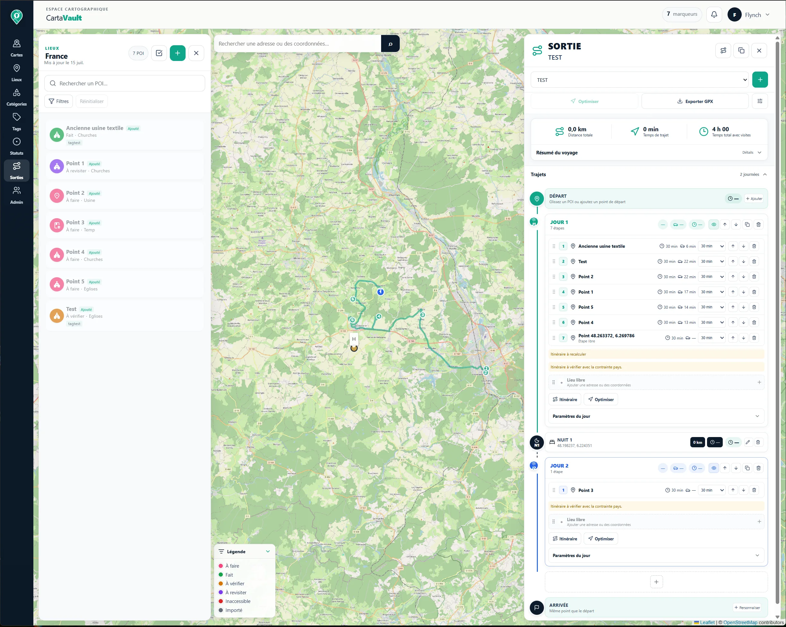
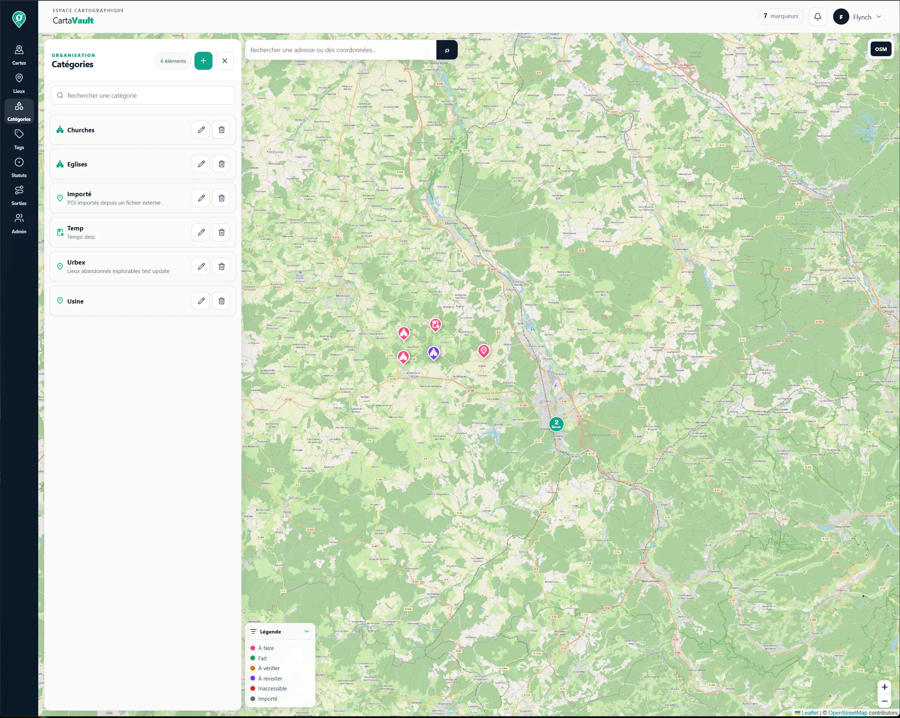
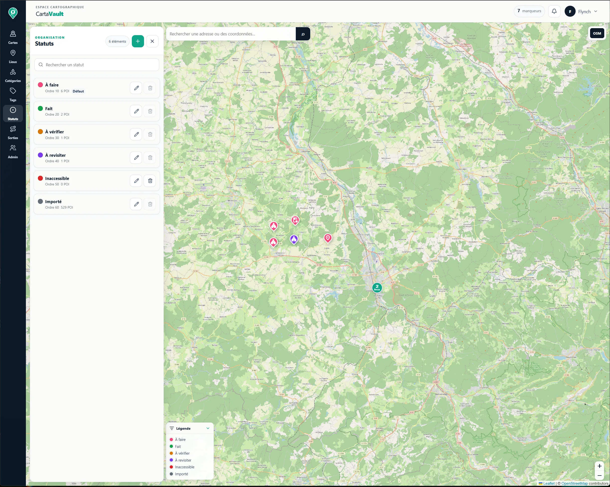
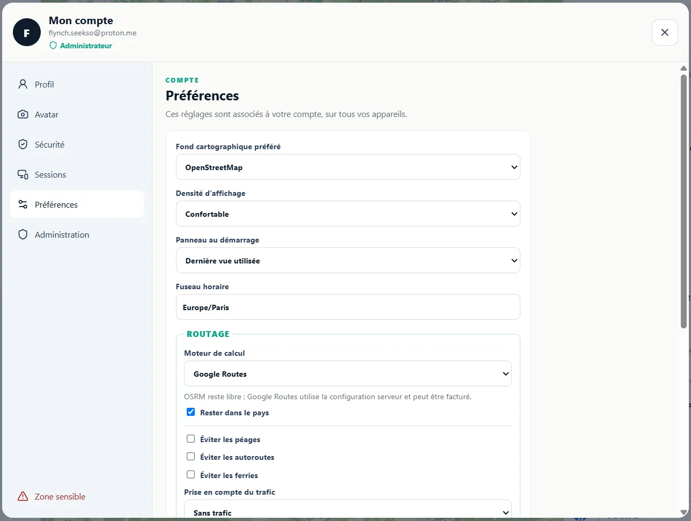

# CartaVault

The administration console includes an **Instance Status** page reserved for administrators. It aggregates non-sensitive diagnostics about services, usage, security, and maintenance. See the [Instance Status documentation](docs/instance-status.md).

**English**

<p align="center">
  <a href="https://github.com/FlynX9/CartaVault/actions/workflows/ci.yml"></a>
  
  
  
  
  
</p>

**CartaVault** is an open-source, self-hosted mapping application designed to centralize points of interest, organize private maps, and plan structured outings while keeping full control of your data.

It combines a **FastAPI** backend, a **PostgreSQL/PostGIS** database, and a **React TypeScript** interface built around a persistent Leaflet map.

> [!IMPORTANT]
> CartaVault is under active development. The application can already be used locally, but deployment and migration procedures, as well as some interfaces, may still change before the first stable release.

## Table of contents

- [Overview](#overview)
- [Features](#features)
- [Architecture and technical stack](#architecture-and-technical-stack)
- [Quick start on Windows](#quick-start-on-windows)
- [Google Routes configuration](#google-routes-configuration)
- [Backup and restore](#backup-and-restore)
- [Security audit](#security-audit)
- [Security](#security)
- [Continuous integration](#continuous-integration)
- [Project status](#project-status)
- [Contributing](#contributing)
- [License](#license)

## Overview

### Place management

<p align="center">
  
</p>

### Outing planning

<p align="center">
  
</p>

### Organization and customization

<table>
  <tr>
    <td width="50%">
      
    </td>
    <td width="50%">
      
    </td>
  </tr>
  <tr>
    <td align="center"><strong>Categories and icons</strong></td>
    <td align="center"><strong>Tracking statuses</strong></td>
  </tr>
</table>

### User account

<p align="center">
  
</p>

## Features

### Maps and places

- private maps associated with a country;
- POI display with loading restricted to the visible map bounds;
- local clustering of standard markers;
- place creation from the map, geographic search, or GPS coordinates;
- detailed place records with descriptions, coordinates, categories, tags, status, photos, and links;
- automatic international administrative-region resolution with manual correction;
- optional fields configurable per map;
- favorites, pre-visit and post-visit ratings, sorting, and advanced filters;
- bulk actions, trash, restore, and audit history;
- direct Google Maps links when coordinates are available.

### Categories, icons, tags, and statuses

- full management of categories, tags, and statuses;
- a closed local catalog of **300 icons**, shared between the frontend and backend;
- no user-provided URLs, arbitrary SVG files, or network calls for icons;
- the primary category determines the marker icon;
- the status determines its color;
- compact legend for active statuses;
- clear separation between tracking status and the physical condition of a place.

### Photos

- multiple JPEG, PNG, and WebP uploads;
- main photo selection;
- reordering and deletion;
- accessible full-screen POI gallery with keyboard, swipe, loading, and per-image error handling;
- secure local storage, separate from user avatar storage.

### Import and export

- two-step KML/KMZ import with preview and confirmation;
- support for `Point` `Placemark` elements, `ExtendedData`, and embedded images;
- validation of archives, paths, sizes, links, and duplicates;
- preservation of unmapped fields in custom fields;
- outing export to Google Maps, GPX, and KMZ.

### Outing planning

- outings split across multiple days;
- steps linked to a POI or added freely;
- drag-and-drop addition and reordering;
- accommodation between two days;
- separate calculations for distance, driving time, visits, buffers, and safety margin;
- recommended departure time or estimated arrival time;
- customizable daily workload thresholds;
- optional route-order optimization, always subject to user validation;
- one route color per day;
- warnings for outdated or partial routes.

### Routing

CartaVault uses **OSRM** by default and can use the **Google Routes API** as an alternative routing engine.

- routing engine selected in account preferences;
- one Google API key per user;
- server-side encryption using a Fernet master key;
- user API keys are never returned to the browser;
- quotas and errors are isolated per user;
- automatic fallback to OSRM after Google credentials are removed;
- a “Stay within the country” option with validation of the calculated geometry.

### Multi-user support and permissions

- authentication with server-side sessions;
- private maps by default;
- one owner per map;
- members with `viewer` or `editor` roles;
- global administrators;
- permissions applied consistently to maps, places, and outings;
- an Account area for profile details, avatar, security, sessions, preferences, and account deletion or anonymization.

> [!NOTE]
> Public registration requires administrator approval. Registration and password-reset emails use the Resend key configured in Administration; public maps and automatic map-invitation emails are not currently available.

The CartaVault interface is available in French and English. Authenticated
users select their language in **Account → Preferences**; the preference is
stored server-side and applied without a page reload. Public authentication
screens initially follow the saved local choice or browser language, with
`VITE_DEFAULT_LANGUAGE=fr` as the instance fallback. Registration approval and
password-reset emails are rendered from matching repository-hosted FR/EN
templates.

### Map layers

The map layer can be changed without reloading the map:

- CartaVault Light;
- CartaVault Dark;
- Satellite;
- OpenStreetMap Standard.

CartaVault Light and Dark are locally hosted MapLibre styles backed by OpenFreeMap vector tiles and rendered inside the existing Leaflet map. They require no account or API key. The satellite source remains independently configurable and OpenStreetMap Standard remains the controlled raster fallback. Individual providers can be hidden with `VITE_BASEMAP_LIGHT_ENABLED`, `VITE_BASEMAP_DARK_ENABLED`, `VITE_BASEMAP_SATELLITE_ENABLED`, and `VITE_BASEMAP_OSM_ENABLED`. See `frontend/README.md` for provider URLs, attribution, public-instance limitations, and the self-hosted OpenFreeMap or PMTiles migration path.

### Application theme

The user menu exposes CartaVault's light/dark switch. The choice is stored
locally with a user-scoped preference, applied before React starts to prevent a
theme flash, and restored after refresh. With no explicit choice CartaVault
follows `prefers-color-scheme`. The application theme covers the workspace,
place popup, Trips, administration, forms, dialogs, notifications, and
loading/empty/error states. CartaVault's OpenFreeMap background follows the
selected theme; Satellite and an explicitly selected OSM fallback remain
independent.

## Architecture and technical stack

### Repository structure

```text
CartaVault/
├── backend/
│   ├── app/                 # feature-oriented FastAPI API
│   ├── migrations/          # Alembic migrations
│   ├── storage/             # local file storage
│   └── tests/               # backend tests
├── database/
│   └── init/                # PostgreSQL/PostGIS initialization
├── docs/
│   └── screenshots/         # project screenshots
├── frontend/                # Vite, React, TypeScript, and Leaflet
├── shared/                  # shared frontend/backend resources
├── docker-compose.yml
├── LICENSE
├── README.fr.md
└── README.md
```

Detailed backend documentation is available in [`backend/README.md`](backend/README.md).

### Stack

| Area | Technologies |
|---|---|
| Frontend | React, TypeScript, Vite, Leaflet |
| Backend | FastAPI, SQLAlchemy, GeoAlchemy2 |
| Database | PostgreSQL, PostGIS |
| Migrations | Alembic |
| Tests | pytest and automated frontend tests |
| Local deployment | Docker Compose |

## Quick start on Windows

### Requirements

- Git;
- Docker Desktop with Docker Compose;
- Python 3.14;
- Node.js and npm.

### 1. Database

From the repository root:

```powershell
Copy-Item .env.example .env
docker compose up -d postgres
```

The Docker initialization script installs only the PostgreSQL extensions.
Alembic creates and upgrades the complete CartaVault schema. Make sure the
container is running before continuing:

```powershell
docker compose ps
```

### 2. Backend and first administrator

```powershell
Set-Location backend
python -m venv .venv
.\.venv\Scripts\Activate.ps1
python -m pip install -r requirements.txt
Copy-Item .env.example .env
```

Then configure the required variables in `backend/.env`, especially `DATABASE_URL`. Never commit this file.

For a local installation, apply every migration and then create the first
administrator:

```powershell
python -m alembic upgrade heads
python -m app.cli create-admin
```

The `create-admin` command is retained for local development and recovery.
Container installations use automatic migrations followed by the protected
six-step web setup wizard documented in
[`docker/README.md`](docker/README.md). The wizard creates the first
administrator and locks itself permanently afterwards.

Then start the API:

```powershell
python -m uvicorn app.main:app --reload
```

Swagger is available at <http://127.0.0.1:8000/docs>.

> [!IMPORTANT]
> Back up the database and media before an upgrade. Production deployments
> must use the version-matched one-shot migration job; do not run ad hoc
> migration sequences during rollout.

### 3. Frontend

In a second terminal, from the repository root:

```powershell
Set-Location frontend
npm ci
Copy-Item .env.example .env
npm run dev
```

`npm ci` uses `package-lock.json` to install the exact dependency versions validated by the project. For local development, leave `VITE_API_BASE_URL` empty to use the Vite proxy to the API at `127.0.0.1:8000`.

Vite displays the local address, usually <http://localhost:5173>.

## Google Routes configuration

Each user can store their own Google Routes key from the Account area. The instance must also define a master encryption key:

```text
CARTAVAULT_CREDENTIALS_ENCRYPTION_KEY=<fernet-key>
```

Generate one with:

```powershell
python -c "from cryptography.fernet import Fernet; print(Fernet.generate_key().decode())"
```

This key is not required to start CartaVault with OSRM. It becomes mandatory when storing or using personal Google Routes credentials.

Store this value in a deployment secret or an untracked `.env` file. Losing it makes previously stored Google keys impossible to decrypt.

Restrict the Google key to the Routes API and, whenever possible, to the server IP addresses. Also configure quotas and budget alerts in Google Cloud.

## Backup and restore

For production Docker deployments, follow the [backup and restore runbook](docs/backup-and-restore.md). It covers the PostgreSQL/PostGIS database, media, optional temporary exports, secret handling, automated backups, integrity checks, restore tests, and retention.

## Security audit

The latest authentication, session, CSRF, RBAC and data-isolation review is
documented in the [security audit report](docs/security-audit-2026-07.md).

## Security

Before publishing or deploying the project:

- never commit `.env` files;
- never store API keys, passwords, or Docker secrets in Git;
- back up the database before running migrations;
- use separate encryption keys and secrets for each environment;
- configure restrictions for Stadia Maps and Google Routes keys;
- review the Git history before making a repository public.

## Continuous integration

GitHub Actions validates every branch and pull request. The backend job uses
an isolated PostgreSQL/PostGIS service, applies and checks Alembic migrations,
compiles Python, and runs the complete pytest suite. The frontend job uses
`npm ci`, verifies generated category icons, lints, tests, and builds the Vite
application. A separate secret scan checks committed history.

The dependency audit runs on pull requests, every Monday, and on demand.
Frontend high and critical advisories and every confirmed Python advisory are
blocking. Registry outages are reported separately and never interpreted as a
clean audit. See the
[dependency security policy](docs/dependency-security.md) for local commands
and the temporary-exception process.

## Project status

### Permission-aware home dashboard

Authenticated users land on `/dashboard`, which summarizes only maps they can
access. It combines place, map, country, trip, media, status, country, category,
recent-item, data-quality, and geographic aggregates without fabricating
historical trends. Owner, editor, and viewer memberships use the same read
model; edit shortcuts are offered only when the active map is editable.

The geographic preview deliberately uses aggregated coordinate buckets and the
existing CartaVault basemap stack. Recent activity is shown only from reliable
place-history records. Empty accounts and unavailable dashboard data have
dedicated, localized states.

### Custom statuses and visit filters

Statuses are scoped to each map and remain fully customizable. Every status is
classified as either `non_visited` or `visited`; this functional state, rather
than a status or category name, drives visit filters, counters, ratings and map
results. New maps receive four editable defaults: To do, To review, Visited
and À refaire. The main Places filters stay stable (All, Not visited, Visited,
Favorites), while advanced filters expose the real statuses of the active map.

### Unified trash

Deleting a map, place, or trip now moves it to the permission-scoped **Trash**
workspace under Organization. Deleted resources immediately disappear from
normal lists and API reads, but owners or editors with the required resource
permission can restore them before their purge deadline. Users choose a
retention period from 7 to 365 days in Account preferences; the default is
30 days. Expired resources are purged at startup and by an hourly backend job.

### Already available

- maps and places;
- categories, tags, statuses, and 300 local icons;
- photos;
- KML/KMZ import;
- users, roles, and permissions;
- outing planning and optimization;
- OSRM and Google Routes routing;
- advanced filters and bulk actions;
- unified map, place, and trip trash with configurable retention;
- Account area and user preferences.
- reusable per-user quota profiles with administrator assignment and backend enforcement;

### Before a stable release

The main remaining work includes:

- finalizing production deployment;
- continuously improving the interface and accessibility;
- strengthening installation and migration documentation;
- optional object storage for distributed deployments;
- registration and invitation flows suitable for a potential SaaS offering.

Detailed progress is tracked in the [GitHub issues](../../issues).

## Contributing

Contributions, bug reports, and improvement proposals are welcome through GitHub issues and pull requests.

Before starting a significant contribution, please open an issue to discuss the need and how it should fit into the project architecture.

## License

CartaVault is distributed under the MIT License. See [`LICENSE`](LICENSE) for details.

Made in Vosges
# Administration

The central CartaVault console is available at `/admin` to administrators only. It brings together paginated user management, safe global credentials, quotas, and instance diagnostics. Personal keys remain in the user account and infrastructure secrets are never exposed. See the [settings audit](docs/administration-audit.md).
# Media library

CartaVault includes a centralized **Media** workspace for every authenticated
user. It only lists photos attached to maps the user owns or belongs to; global
administration does not grant access to private map media. The library provides
server-side pagination, search, map/format/primary/diagnostic filters, safe
downloads, lazy WebP thumbnails, metadata editing, primary-photo selection,
and permission-checked single or bulk deletion.

The original local storage remains private. API responses never expose an
absolute or relative storage path. Generated thumbnails are stored below the
configured photo storage root and can be recreated at any time.
